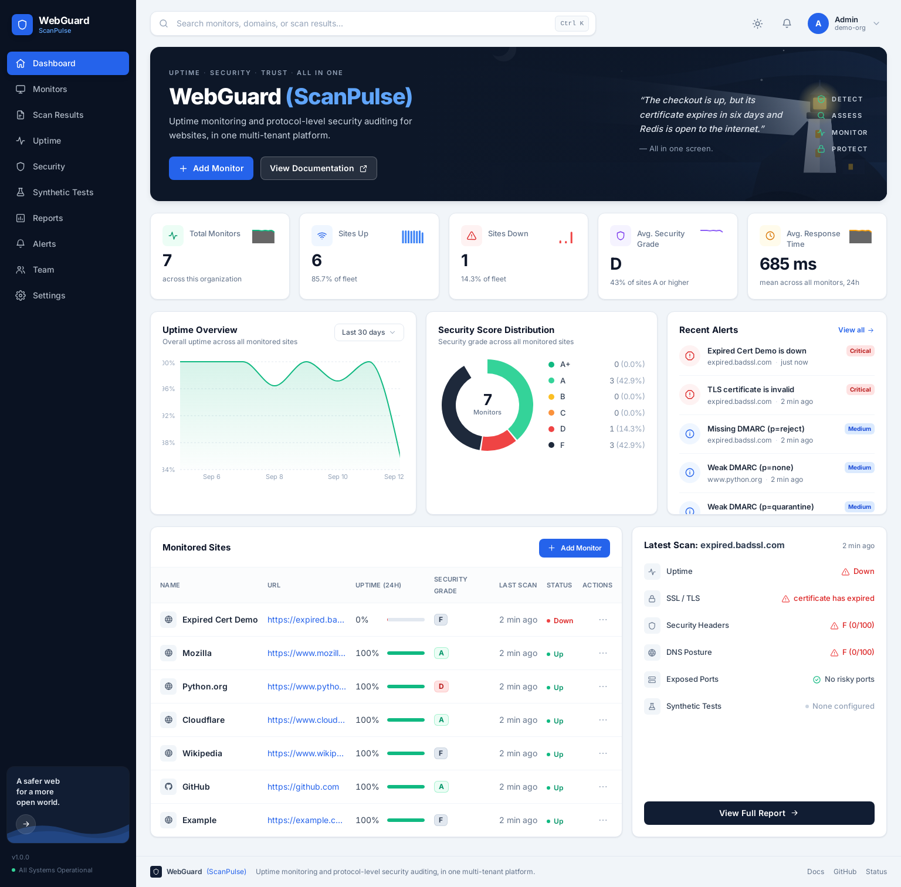
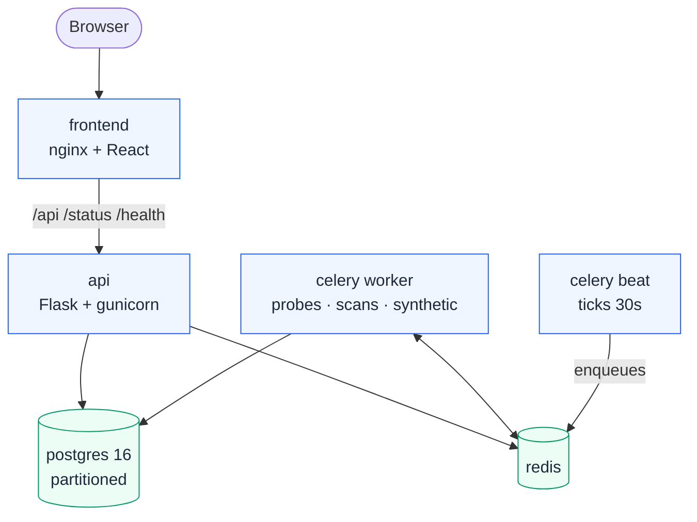
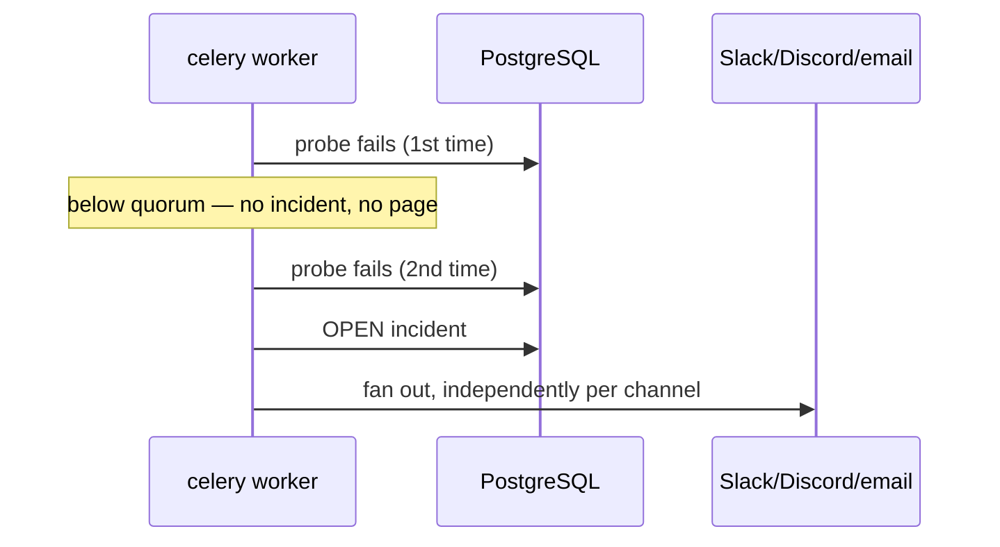
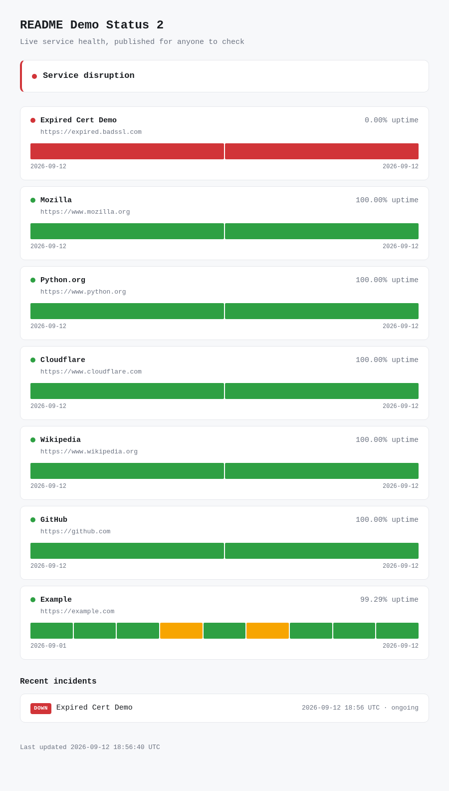

<div align="center">

# WebGuard (ScanPulse)

**Uptime monitoring and protocol-level security auditing for websites, in one multi-tenant platform.** Most tools do one or the other — WebGuard checks whether a site is up *and* whether its TLS, headers, DNS and open ports are safe, on the same schedule, and reports both together.

[](https://github.com/Nitishjha7/webguard-scanpulse/actions/workflows/ci.yml)
[](backend/tests/)
[](LICENSE)
[](backend/app/__init__.py)
[](backend/app/models/)
[](backend/app/tasks/)
[](frontend/)

</div>

<p align="center">
  
</p>

<p align="center">
  <a href="#quick-start">Quick start</a> ·
  <a href="#how-it-works">How it works</a> ·
  <a href="#api">API</a> ·
  <a href="docs/">Engineering notes</a>
</p>

---

## Overview

| | |
|---|---|
| **Backend** | Flask 3, Python 3.11, SQLAlchemy 2.0, Alembic |
| **Async** | Celery 5.4 + Beat, Redis 7 |
| **Data** | PostgreSQL 16 — partitioned `ping_logs`, hourly/daily rollups |
| **Checks** | TLS handshake, HTTP headers, DNS (SPF/DMARC/DNSSEC/CAA), port scan, Playwright synthetic journeys |
| **Frontend** | React 18 (Vite), Tailwind, Recharts |
| **Infra** | Docker Compose (6 containers), nginx, GitHub Actions CI |
| **Tests** | 307, against a real Postgres database |

---

## How it works



Beat ticks every 30s and asks Postgres which monitors are due — a fixed cost
whether there are 10 monitors or 10,000. Three queues (`probes`, `scans`,
`synthetic`) keep a slow browser check from delaying a fast uptime probe.

**One failed probe never pages anyone.** An incident opens only after 2
consecutive failures (anti-flapping quorum), but closes on a single success —
a site serving traffic should never sit labelled "down" waiting out a timer.



<p align="center">
  
</p>

<p align="center"><sub>The public status page above shows that exact incident — banner, per-site state and the incident log all read from the same database at request time.</sub></p>

A few other decisions worth knowing about:

- **SSRF-hardened.** Every probe resolves the hostname first and refuses the
  target if *any* resolved address is loopback, RFC1918, link-local (covers
  `169.254.169.254`), or CGNAT. Synthetic journeys get a second layer — a
  Playwright route handler blocks non-public requests at runtime too.
- **A partial unique index** (`UNIQUE (monitor_id) WHERE resolved_at IS NULL`)
  stops two workers racing to open duplicate incidents.
- **A failing alert channel never silences the others** — each delivery is
  independent, and a channel auto-disables after 10 straight failures.
- **`ping_logs` is range-partitioned by month**, so retention is a `DROP
  TABLE`, not a `DELETE` walking hundreds of millions of rows.
- **Public status pages disclose the minimum.** Monitor URLs and latency are
  opt-in; incident root-cause text is never published — it's written by our
  own probes and often names internal infrastructure.

---

## Quick start

Only Docker Desktop is required.

```bash
git clone https://github.com/Nitishjha7/webguard-scanpulse.git
cd webguard-scanpulse

cp .env.example .env
docker compose up --build
docker compose exec backend flask seed-demo
```

| Service | URL |
|---|---|
| Dashboard | http://localhost:3000 |
| API | http://localhost:5000 |
| Health | http://localhost:5000/health/ready |

**Demo login:** `admin@webguard.local` / `changeme123`

Log in, add a monitor's URL, and it starts checking uptime, TLS, headers, DNS
and open ports on a schedule — no further setup.

---

## API

All `/api/v1/*` routes need `Authorization: Bearer <token>` and are scoped to
the caller's org — a resource from another tenant is a 404, not a 403.

| Resource | Endpoints |
|---|---|
| Auth | `register`, `login`, `refresh`, `me`, `users` |
| Monitors | CRUD + `/scan`, `/pings`, `/uptime`, `/ssl`, `/security`, `/incidents` |
| Incidents | list, summary, get, `/resolve` |
| Channels | CRUD + `/test` (Slack, Discord, email, webhook) |
| Synthetic | CRUD + `/run`, `/runs`, `/runs/<id>/screenshot` |
| Status pages | CRUD, plus public `/status/<slug>` and `/status/<slug>.json` |

Full reference with request/response shapes: [docs/](docs/).

---

## Testing

```bash
docker compose exec -e FLASK_ENV=testing backend pytest   # 307 tests, ~35s
```

Runs against a real Postgres, not SQLite — the schema uses JSONB, a partial
unique index, declarative partitioning and `percentile_cont`, none of which
SQLite has. Same suite runs in [CI](.github/workflows/ci.yml) on every push.

---

## Project structure

```
backend/            Flask app — blueprints, engines, models, services, tasks, tests
celery_worker/       Worker image (Python + Chromium)
frontend/            React dashboard (Vite → nginx)
docs/                Architecture, per-phase engineering notes, screenshots
.github/workflows/   CI
```

---

## Engineering notes

| | |
|---|---|
| [Architecture](docs/architecture.md) | Original design |
| [Testing](docs/testing.md) | What's covered and why |
| [Phase 1–6](docs/) | Scaffold → engines → alerting → synthetic/ports → partitioning → dashboard |

---

## Not built

- **Dashboard covers the home page only** — other nav items show an honest
  placeholder naming the API endpoints that already work.
- **Single region** — quorum is modelled per-region but every probe runs in one place today.
- **No Twilio SMS, no API rate limiting** — Redis is in place for both; not wired up.
- **Not deployed** — the Compose stack is production-shaped; nothing is hosted yet.

---

## Tech stack

Python 3.11 · Flask · SQLAlchemy 2 · Alembic · PostgreSQL 16 · Celery + Beat ·
Redis 7 · Playwright · cryptography · dnspython · React 18 · Tailwind ·
Recharts · nginx · Docker Compose · GitHub Actions

## License

[MIT](LICENSE) © Nitish Kumar Jha
